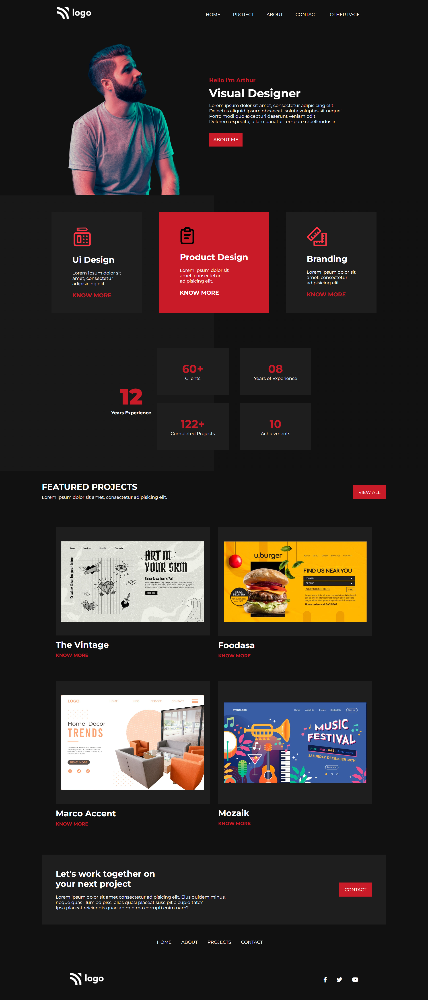

# Static Webpage Template - 15

## A static template webpage of a professional individual

- This webpage was constructed by using only HTML and CSS as a markup and styling language respectively.
- Webpage consists of many sections such as navigation section, header section, portfolio section, achievement section, and footer section.
- This webpage is currently hosted on netlify.
- This is a all screen size responsive webpage.

## Built with

- [VScode](https://code.visualstudio.com/) as a code editor.
- [Git](https://git-scm.com/) as version control system.
- [GitHub](https://github.com/) to manage git repository.
- [Netlify](https://www.netlify.com/) as a website hosting platform.

## Webpage Templete screenshot




## Hosted webpage link

[Static Webpage Template - 15](https://static-webpage-template-15.netlify.app/)

## My learnings

> Handling image inside the grid

> flex-start to begin the flex

> Spliting the background image as two

## My info:

### _*Raghavendra Tejas*_

```shell
tejasraghavendra8@gmail.com
```

## Special credits

Team at [ineuron](https://ineuron.ai/) and [Hitesh Choudhary](https://github.com/hiteshchoudhary)
